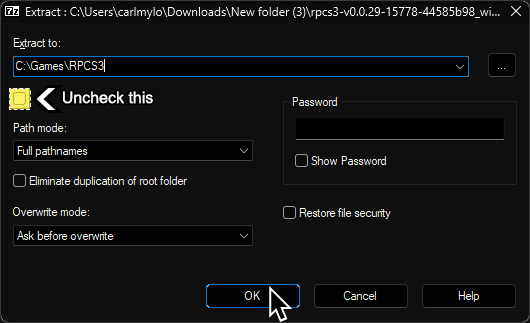
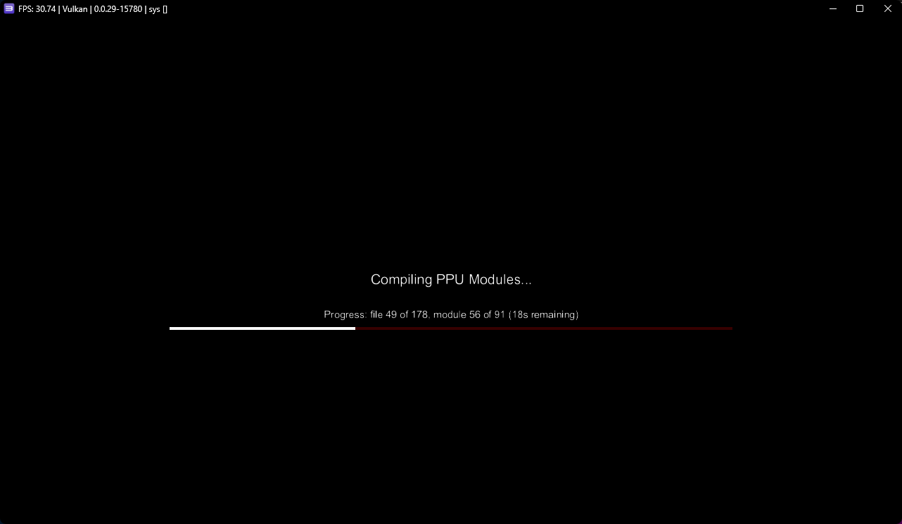
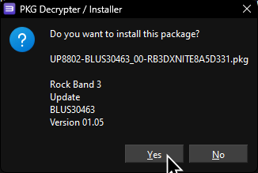
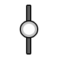
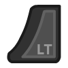

`Last Updated: 2023-08-22T03:56:56+00:00`

Video Version (Outdated):  
 - YouTube")

>##### WARNING:
_This tutorial will **not** provide you with a download to the game or DLC. None of the Discord servers listed will provide you with them, either. Make a backup of your own copy or Google for help. **Piracy is illegal and attracts Tim Sweeney's lawyers**._

1. [_Requirements_](#Requirements)
2. [_Installation_](#INSTALLATION)
3. [_Configuration_](#config)
4. [_Controllers (RB/GH Guitars, Drums, and Gamepads)_](#ctrl)
5. [_User Account_](#useraccount)
6. [_RPCN_](#rpcn)
7. [_Custom Configuration_](#custconfig)
8. [_CPU_](#cpu)
9. [_GPU_](#gpu)
10. [_Audio_](#audio)
11. [_I/O (Wired Pro Guitars and USB/MIDI Keyboards)_](#io)
12. [_Network_](#network)
13. [_Advanced_](#adv)
14. [_Emulator_](#emu)
15. [_Wireless PS3 Mustang Pro Guitars and Keyboards with Dongles_](#prodong)
16. [_Troubleshooting_](#trsht)
17. [_Conclusion_](#end)

>## REQUIREMENTS:
You will need:
* _A ripped copy of Rock Band 3 for the PS3. (Ideally BLUS-30463)_
* _11.12 GBs of space minimum. (145.66 GBs for **all** officially released content dating from RB1 to RB3, including DLC, RBN, and exports)_
* _An instrument controller. You can use:_
	*   _Any Rock Band and Guitar Hero Guitar (PS3, PS4, Wii, X360)_
	*   _Any Rock Band and Guitar Hero Drums (PS3, PS4, Wii, X360)_
	*   _Rock Band 3 Keyboard (PS3 version via dongle only)_a b
	*   _Rock Band 3 Fender Mustang PRO-Guitars \[**Wireless**\] (PS3 version via dongle only)_a
	*   _Rock Band 3 Fender Mustang PRO-Guitars \[**Wired**\] (PS3, Wii, X360 via MIDI to USB adapter)_
	*   _Rock Band 3 Squier Stratocaster PRO-Guitars (PS3, Wii, X360 via via MIDI to USB adapter)_
	*   _Any MIDI Keyboards (**37 keys minimum** via USB or MIDI to USB adapter)_b c
	*   _MIDI Drumkits (via USB or MIDI to USB adapter with MidiDrumHero and VJoy)_d
	*   _Microphones (game can be controlled with most game controllers or typing keyboard when playing as a vocalist)_
*   _A computer_
	* This guide has been tested on specs as low as Intel Core i5-4460, Intel Core i5-6500, Intel Core i7-3770, and AMD Ryzen 3 3200G CPUs. It has also been tested on GPUs as low as NVIDIA GTX 1650, AMD Radeon RX 550. Although we suggest 16 GBs of RAM, it has worked on 8 GBs of RAM. This game also technically run on a SteamDeck but that's beyond the scope of this tutorial. 
    You can check [RPCS3’s page for suggested specifications here](https://rpcs3.net/quickstart).
*   _[7zip](https://www.7-zip.org/download.html) (or WinRAR if you hate yourself)_

a Wii Rock Band instrument controllers and dongles can be converted for PS3, but this is beyond the scope of this tutorial. Google is your friend.  
b Connecting keyboards via MIDI with less than 37 keys is possible but not ideal so are therefore exempt from this tutorial.  
c Certain MIDI keyboards, notably Yamaha ones, may exhibit problems due to their MIDI implementation. This is known and a solution is being worked on.  
d I don’t have a MIDI Drumkit so there is no set up tutorial for this. Apologies. If you have one and would like to help by sending in screenshots of the setup process, please contact me on the Milohax Discord.

>## INSTALLATION:

We’ll be downloading an older version of RPCS3 as it performs better at the moment. Although this guide is Windows-centric, I have linked Linux and Mac OS just in case you want to try it on those operating systems. For those curious (nerds), this is the last RPCS3 build before the QT6 merge which has various problems.

|  |  |  |
|---|---|---|

Once it downloads, extract the .7zip file  

I would strongly suggest extracting the files into “C:\\Games\\RPCS3” or a separate internal drive to avoid  permissions issues. I'd also untick the box that will create the massive sub-directory as shown highlighted in the picture. Avoid installing and running from an external drive as it can cause massive issues.  

Once that’s extracted, [download the PlayStation 3 system software from Sony’s website](https://www.playstation.com/en-us/support/hardware/ps3/system-software/). **Scroll down** until you get to “**Update using a computer**”, **click that** to expand, then click on “**Download PS3 Update.**”  
  
_**If you’re on a Chromium based browser like Chrome or Edge, MAKE SURE YOU RIGHT CLICK AND “Save link as”, or it MAY become stuck.**_

Once again, the picture below links to the download page.

Now **open up RPCS3**, and **drag** the **PS3UPDAT.PUP** you just downloaded from Sony’s website **into RPCS3** **then click Yes**.  

**Let it install.**  

**When it finishes, click OK**  

It will start compiling modules, which may take a few minutes. **Let it do its thing.**  

Next, **go to the folder where you have your copy of Rock Band 3 stored and drag the folder into RPCS3**. Again, you're on your own here. [I used “PS3 Disc Dumper” for this because it’s the easiest way.](https://youtu.be/mRxSKxoYt_g)

With Rock Band 3 now in your game library in RPCS3, however you may notice that it’s out of date (depending on your copy of the game.) Let’s fix that. You will need to download the update PKG file which is linked below. This directly links to Sony’s official download. You may get security warnings as Sony’s update server lacks HTTPS.  
[\[CLICK HERE TO DOWNLOAD ROCK BAND 3 UPDATE PKG\]](http://b0.ww.np.dl.playstation.net/tppkg/np/BLUS30463/BLUS30463_T4/e52d21c696ed0fcf/UP8802-BLUS30463_00-ROCKBAND3PATCH05-A0105-V0100-PE.pkg)

The filename will look something like this:

When that’s finished, drag the update file into RPCS3 and click Yes, just like you did earlier with the PS3UPDAT.PUP file.  

>## _CONFIGURATION_:

_**IF YOU HAVE CHANGED SETTINGS FOR RPCS3, SET THEM BACK TO DEFAULT FOR ROCK BAND 3 BEFORE FOLLOWING THIS TUTORIAL!**_

> _**CONTROLLERS**_

**This is for standard (five fret guitars, RB/GH drums) controllers.  
Pro Guitars, or Keyboards are set up later.**

Right click “Rock Band 3” and click on **“Create Custom Gamepad Configuration”**

**If you are planning on plugging in multiple instruments, you must make profiles for each of them.**

**\- PS3 standard guitar and drum controllers _should_ be plug and play. If, for some reason, they’re not, you will need to bind them as detailed below.  
****\- If you’re using PS3, PS4, or Wii controllers**, **set** the “**Handlers**” option **to** “**MMJoyStick**.”  
**\- If you’re using Xbox controllers**, **set** the “**Handlers**” option **to** “**XInput**”

Below are the buttons you should map in RPCS3’s Gamepad Settings. **[\[You can also check RPCS3’s website for reference as well\]](https://wiki.rpcs3.net/index.php?title=Help:Peripherals_and_accessories#Configuring_Instruments).**

**If your controller isn’t being detected, hit “Refresh”. If that doesn’t solve it, restart RPCS3.**

When you’re finished, **remember to click “Save”.**

  
**Guitar**:  
Make sure you **set “Device Class” to “Guitar”.**

Switch the dropdown menu next to it to"Rock Band" if you’re using a Rock Band guitar or leave it on “Guitar Hero” if you’re using a Guitar Hero guitar.  
**Some guitar controllers** (most notably Guitar Hero controllers) **misbehave and refuse to map** sometimes. If you try mapping a button and get “U+”, try pressing “**Filter Noise**” the bottom left of the controller configuration.

| **RPCS3**          | **Rock Band Guitars** | **Guitar Hero Guitars** |
|:------------------:|:---------------------:|:-----------------------:|
| Cross |  |  |
| Circle |  |  |
| Square |  |  |
| Triangle |  |  |
| L1 |  |  |
| D-Pad: Up |  |  |
| D-Pad: Down |  |  |
| Right Stick: Right |  |  |
| L2 |  | |
| R1 |  | |

**Drums**:

Make sure you **set “Device Class” to “Drum”.**

Switch the dropdown menu next to it to"Rock Band" if you’re using Rock Band drums, “Rock Band Pro” if you’re using Rock Band Drums with Pro expansions, or leave it on “Guitar Hero” if you’re using Guitar Hero drums.

| **RPCS3**    | **Rock Band Drums** | **Rock Band Pro Drums** | **Guitar Hero Drums** |
|:--------:|:---------------:|:-------------------:|:-----------------:|
| Cross |  |  |  |
| Circle |  |  |  |
| Square |  |  |  |
| Triangle |  |  |  |
| L1 |  |  |  |
| D-Pad |  |  |  |
| R1 |  |  |  |
| R3 |  | Cymbal Modifier | |
| L3 |  | Pad Modifier | |

**Vocals**:  
Vocals use regular controllers. If you're using a PS4 controller, switch to DS4. If you're using an Xbox One controller, switch to XInput. You don't have to remap anything. You can also use a typing keyboard and use this guide as reference to change the mapping to your liking.

| **PlayStation (DS4)** | **Xbox One (XInput)** | **Use**                         | **Alt Use**         |
|:---------------------:|:---------------------:|:-------------------------------:|:-------------------:|
|  |  | Navigation |
|  |  | Navigation |
|  |  | Select                          |
|  |  | Back                            | Mic 3 Volume (Song) |
|  |  | Mic 1 Volume (Song) |
|  |  | View More Info (Library)        | Mic 2 Volume (Song) |
|  |  | Options                         | Pause (Song)        |
|  |  | Filters (Library)               | Overdrive (Song)    |
|  |  | Guide Part Selection (Practice) |
|  |  | Vocal Part Selection (Practice) |
|  |  | Vocal Track Volume (Song)       |
|  |  | Pitch Correction (Song)         |

  

As an example, here’s what a _Wii The Beatles: Rock Band Hofner_ controller looks like when it’s setup:  

>## USER ACCOUNT:
In RPCS3, go to **Manage > User Accounts**  

Once you’re there, click on the default username and then click **“Rename user”** and change it to whatever you want, then close it out.  

> **RPCN ACCOUNT**

**If you don’t want to play online, you can skip this** part.

Go to **Configuration > RPCN**

  
Click on “**Account**”:  
  
Click “**Create Account**”:  
  
Enter a **username** and **password**:  
  
  
You will be prompted for an **email address** so you can receive a **verification token**:  

**Click “Yes”** and go to your email inbox. You may have to wait a few minutes to get it. If you’re still waiting, check your spam inbox. The email will be called **“Your token for RPCN.” Copy the token**:

**Paste the token** into RPCS3 and click OK:  

> **CUSTOM CONFIGURATION**

**Right click on Rock Band 3** in RPCS3, then click on “**Create Custom Configuration**”  

This may seem overwhelming due to the sheer number of options but **we’re leaving most of it alone.** We’ll go tab by tab, starting with:

> **CPU**
You shouldn’t have to change anything here.

_**EXTRA: IF YOU HAVE PERFORMANCE ISSUES:  
**_

*   _Change “**SPU Decoder**” to "**Recompiler (LLVM)**“. This will add extra startup time when you launch the game but will usually result in less stutter._
*   _Change “**SPU Block Size**” to “**Mega**”.  
    _
*   __Change “**Preferred SPU** **Threads**” to “**1**”. Great for CPUs with only a few cores.__
*   __**Install RB3DX** after completing setup and **disable “Post Effects.”**__
*   __As a **last resort**, change **“SPU XFloat Accuracy”** to **“Relaxed XFloat”** along with the previous suggestions. **This will break practice mode!**__

_Again, **if you don’t have performance issues, LEAVE THIS ALONE!**_

> **GPU**

  
  
**Enable** “**Write Color Buffers**”. As this is a **NECESSARY** change, I have highlighted it in the screenshot.

_**EXTRA: IF YOU HAVE PERFORMANCE ISSUES:**_ _\-Change your “**ZCULL Accuracy**” to “**Relaxed (Fastest)**”__\-Change your “**Shader Quality**” to “**Low**” as a last resort as this really degrades the game’s aesthetics._

> **AUDIO**

  
**Enable “Enable Buffering”**.

  
**If you want to set up a microphone** to sing with, **set “Microphone Type” to “Standard"** and use the switch the “Mic” dropdown menus to the microphone you want to sing into. Rock Band 3 only supports 3 microphones at once so ignore Mic4.  
  
**EXTRA: - Try changing the Audio Out from “Cubeb” to “XAudio2” if you’re on Windows.  
\- If you have stuttering audio, increase “Audio Buffer Duration”.** Likewise, if you have a good computer, you can decrease it. **You will have to recalibrate Rock Band 3 after adjusting this.**

> **I/O**

**If you’re not playing with a wired Pro Guitar or a USB/MIDI keyboard**, **skip** over **this section**.  
**If you’re playing with a PS3 Rock Band 3 Keyboard or wireless PS3 Mustang Pro Guitar**, **skip** over **this section**.

**If your keyboard has a USB port**, all you need to do is **plug it into your computer**.  
****

**If your keyboard only has a MIDI output**, you will need **a MIDI to USB interface**. ****

**The same applies to Rock Band 3 Pro Guitars** as they only have MIDI outputs.****

Here’s an example of a MIDI to USB interface. Most will come with a indicator LED to show activity. To check that you plugged it in correctly, **you should see “MIDI In” blinking when you press a key**.

****

Do note that **some audio interfaces have MIDI inputs**, so if you have one, you may already have a way to plug in MIDI to your computer. For example, this Scarlett has MIDI connections in the back.

****

**Once you’re plugged in, change “Emulated Midi device"** to whatever MIDI device you’re playing with. Make sure you set the right device type. **RPSC3 defaults to** **“Keyboard.”**  
**If you’re playing with a Mustang Pro Guitar** via MIDI to USB **set the device** **type to** **“Guitar (17 frets)”  
****If you’re playing with a Stratocaster Pro Guitar** via MIDI to USB **set the device** **type to** **“Guitar (22 frets)”**

As an example, here’s what an Alesis V61 looks like when it’s setup:

**If your instrument isn’t detected in the drop down menu, save your configuration so far and restart RPSC3.**

As **keyboards don’t have** **PS3 buttons**, **the first octave is** reserved **for mapped keys**. Use this picture as reference. I **strongly** suggest putting artist tape, masking tape, or painter’s tape on your keyboard and drawing the buttons for reference.

> **NETWORK**

**If you’re not going to play online, you only need to change the Network Status to “Connected” as highlighted in the picture. If left on “Disconnected”, the game will freeze temporarily when browsing the song library.**

**For online multiplayer, join the \[[RBEnhanced Discord server](https://discord.gg/6rRUWXPYwb)\]** and **go to** the **[\[#gocentral-connecting\]](https://discord.com/channels/953085263008129064/1076031372185042984)** channel. **Follow the instructions for RPCS3**. Although the picture below includes details, this is subject to change, and you should **always refer to the \[[RBEnhanced Discord](https://discord.gg/6rRUWXPYwb)\] for** this **information**. While you’re there, you can also organize sessions with other players.****

> **ADVANCED**

**You will not change anything here** but **pay** special **attention to “VBlank Frequency”.** There are tutorials that will tell you to increase this to 120 Hz for 60fps graphics. **This is unnecessary** and you should install RB3DX for 60fps.   
**LEAVE IT AT 60 Hz unless you’re playing offline, or you run the risk of crashing during online play.**

_**EXTRA: In the rare chance that you freeze after one song or a few songs, increase “Driver Wake-Up Delay”. I’ve seen people set it to 20**_ **_μs or_** _**40**_ **_μs and it fixed it for them._**

> **EMULATOR**

You can leave this as is if you want, but I would consider changing the following options:

*   “Start games in Fullscreen mode” - Obviously just switches to Fullscreen when you start Rock Band 3. I personally enable this.
*   “Show trophy popups” - Mimics the way Trophy notifications appeared on the PS3. I personally disable this as the game has its own pop-ups.
*   **Show shader compilation hint** - This creates a popup whenever RPCS3 is compiling shaders. Whether you leave it on or not is up to you, but I should tell you what this means as it is important:  
    When you run PS3 games, it has to compile shaders to “translate” the graphics from a PS3 format to a format your PC can work with. **The game will** appear to **stutter when this happens**. **This happens on ALL computer systems. When it finishes** compiling an effect, **it will usually never happen again**. **The** **best way to deal with this is** just **to** **play the game** as it will quickly go away.

> _**Wireless PS3 Mustang Pro Guitar and PS3 Rock Band 3 Keyboard with dongle**_

**If you’re not playing with a PS3 Mustang Pro Guitar and PS3 Keyboard with their respective dongles, skip** over **this section.**

To start with, **close out RPCS3** **and plug in the instrument’s dongle** to your computer.

Now, [**\[go to Zadig’s website\]**](https://zadig.akeo.ie/) and **download the latest version.** **Open it** up.

Click on **Options** then **List All Devices  
**

You should now see devices listed. **Switch it to your Rock Band 3 Pro Instrument**. In this example, we’re using the Mustang Pro Guitar, which shows up as “Harmonix RB3 Mustang Guitar for PlayStation® 3”.  

After selecting the right device, you should see the option to replace the driver. **MAKE SURE YOU ARE REPLACING THE DRIVER ONLY FOR THE PRO GUITAR/KEYBOARD.** Click Replace Driver.  

A warning will appear. **Again, make sure you have selected your RB3 Pro Guitar or keyboard instrument.** After you have made sure, click “**Yes”  
**

It will then install the driver. As the program says, it may take a few minutes.  

If everything goes well, you will get this message:  
  

**Close Zadig** and, **with the dongle** still **connected**, **open up RPCS3** and **open Rock Band 3**.

Turn your controller on and you should see it automatically assign a player number.

Likewise, in Rock Band 3, you will see the instrument ready to join.  

> _**TROUBLESHOOTING**_

*   **_Stuttering Audio_**

*   
*   Increase “Audio Buffer Duration” as mentioned in [the Audio tab of Rock Band 3’s Custom Configuration](https://im.carlmylo.com/stream/rockband3#audio) until the stuttering stops. 100 ms is a great starting point for low end computers.

*   **_General performance issues_**
	*   Go back and read the “**EXTRA**” messages in the [Custom Configuration setup section](https://im.carlmylo.com/stream/rockband3#cpu).

*   **_Game doesn’t fill the_** **_screen_**
	*   Enable Overscan in Rock Band 3’s System Settings

*   **_Game is delayed_**
	*   Run Calibration in Rock Band 3’s System Settings if you haven’t for some reason. Disable “Dolby Digital” if you enabled it in the same menu.

*   **_Cannot use Automatic Calibration in System Settings_**
	*   Automatic Calibration only works for PS3 guitar controllers via passthrough.

*   **_Game gets stuck when naming a character_**
	*   This is an RPCS3 issue. You can fix it by changing the effects switch on a RB guitar controller. Otherwise, changing your controller’s Input Handler in “[Create Custom Gamepad Configuration](https://im.carlmylo.com/stream/rockband3#ctrl)” to “Keyboard” then back to whatever you had originally fixes it. This should work while the game is running.

*   **_Characters have flying instruments and accessories_**
	*   There is currently no fix for this. If you experience this, [please report your findings on RPCS3’s Github.](https://github.com/RPCS3/rpcs3/issues/8408)

*   **_Scrolling through library has long pauses_**
	*   You forgot to set the “Network Status” to “Connected” in the [Network tab when setting up the Custom Configuration](https://im.carlmylo.com/stream/rockband3#network) for Rock Band 3.

*   **_My PS3 instrument controller shows up as two_**
	*   You did [controller configuration](https://im.carlmylo.com/stream/rockband3#ctrl) for a PS3 controller, which usually isn’t needed due to passthrough. Just unbind the controller and it should be fine.

*   **_\[ONLINE\] Cannot find a 3rd or 4th player_**
	*   In Rock Band 3’s Custom Configuration, [go to the network tab](https://im.carlmylo.com/stream/rockband3#network) and make sure “Enable UPNP” is enabled. If for some reason you can’t do UPNP, you will need to forward port 9103 (UDP) in your firewall. **Don’t** **enable UPNP while port forwarding** as this can cause crashes.

*   **_\[ONLINE\] Stuck on “Registering Account” when trying to connect to GoCentral_**
	*   You may have lost connection to RPCN or GoCentral and will have to restart the game. If you continue to get this after restart, go to the top menu in RPCS3, “Configuration” > “RPCN” > “Account” > “Test Account” then restart the game to force a reconnection.

*   **_“I followed every step and my game is still crashing”_**
	*   Double check to make sure you have followed every step correctly. This guide has been tested and has been proven to work for plenty of people with varying degrees of hardware. If you are absolutely sure you followed every step correctly, it is 90% likely that the dump of the game you have is bad, and 9% chance your computer ran out of disk space, and 1% chance it’s a skill issue.

> _**CONCLUSION**_

That’s it! You now (hopefully) have a functional setup to play Rock Band 3 on your PC. While you’re here, why not join some communities that are helping keep the Rock Band community alive?

*   **Rock Band 3 Deluxe/Milohax:** Developers of the must-have RB3DX mod that I cannot recommend enough. **[\[Download and setup instructions here.\]](https://github.com/hmxmilohax/rock-band-3-deluxe)** On top of adding many of quality-of-life features like faster bootups, 60fps venues, and automatic DLC loading, **it also includes RB3\_Plus, which adds extra Pro Keys and Pro Guitar/Bass to songs that didn’t have them.** **If you have a Pro instrument, this is a must have**! On top of this, there are various visual customization options, like using themes from older (and newer) Rock Bands and even Guitar Hero. [You can **\[join Milohax’s Discord here\]**](https://discord.gg/xrba4CjdNC).
*   **RBEnhanced:  
    **Developers of the amazing RBEnhanced mod that currently only exists for Xbox 360 and Wii. The same developers also help run and maintain the GoCentral server that is the only way to play Rock Band 3 on PS3 online at the moment. As of writing this, there is an active offshoot that has crossplay with Wii and PS3 players. You can [**\[join RBEnhanced’s Discord here\]**](https://discord.gg/6rRUWXPYwb).

Special thanks to:

*   [DarkRTA](https://www.youtube.com/@darkrta), [Linos](https://www.youtube.com/@LinosMelendi), [Jnack](https://www.youtube.com/@jnackmclain), [Hughtobasic](https://www.youtube.com/@thisisRK), [ihatecompvir](https://www.youtube.com/@ihatecompvir1591), and [LysiX](https://www.youtube.com/@LysiX) for technical information regarding RPSC3 and Rock Band 3.
*   qfoxb, [SlothDemon](https://www.youtube.com/@SlothDemon1991), [Jnack](https://www.youtube.com/@jnackmclain) (tested for nearly 20 hours via autoplay lmao), knvtva, and 1osks for reporting results.
*   RPSC3 Wiki for having pretty decent information on controllers and USB passthrough.

  
This work is licensed under a [Creative Commons Attribution-ShareAlike 4.0 International License](http://creativecommons.org/licenses/by-sa/4.0/).