Versión Vídeo (no actualizada):  
 - YouTube")

 

>##### Advertencia:
_Esta guía **no** te va a dar links para descargar el juego ni el DLC. Ninguno de los servidores de Discord mencionados tampoco te los va a dar. Haz tu propia copia o busque ayuda en Google. **La piratería es ilegal y atrae a los abogados de Tim Sweeney!**._
 

1. [_[Requisitos]_](#requisitos)
2. [_[Instalación]_](#instalación)
3. [_[Configuración]_](#configuración)
4. [_[Desactivar Actualizaciones]_](#desactivar-actualizaciones)
5. [_[Controladores (guitarras, baterías de RB o GH y controles)]_](#controladores)
6. [_[Cuenta de usuario]_](#cuenta-de-usuario)
7. [_[RPCN]_](#rpcn)
8. [_[Configuración Rápida]_](#configuración-rápida)
8. [_[Configuración Personalizada]_](#configuración-personalizada)
10. [_[CPU]_](#cpu)
11. [_[GPU]_](#gpu)
12. [_[Audio]_](#audio)
13. [_[I/O (guitarras Pro y teclados con cable USB/MIDI)]_](#io)
14. [_[Network]_](#network)
15. [_[Advanced]_](#advanced)
16. [_[Emulator]_](#emulator)
17. [_[Guitarras Mustang PRO y teclados inalámbricos de PS3 con receptores]_](#guitarras-mustang-pro-y-teclados-inalámbricos-de-ps3-con-receptores)
18. [_[Soluciones de problemas]_](#soluciones-de-problemas)
19. [_[Conclusión]_](#conclusión)

 

# Requisitos:

Necesitarás:
* _Una copia de Rock Band 3 para PS3 en tu computadora. (Idealmente BLUS-30463)_
* _Un instrumento. Puedes usar:_
	*   _Cualquier guitarra de Rock Band y Guitar Hero (PS3, PS4, Wii, X360)_
	*   _Cualquier batería de Rock Band y Guitar Hero (PS3, PS4, Wii, X360)_
	*   _Cualquier instrumento con salida MIDI compatible con el adaptador MIDI Pro de Rock Band 3 (solo la versión de PS3)_a
	*   _Cualquier batería electrónica con salida MIDI con el adaptador MIDI Pro de Rock Band 3 (PS3, Wii, X360)_
	*   _Teclado inalámbrico Rock Band 3 (solo la versión de PS3 con receptor propio)_a b
	*   _Guitarra PRO de Rock Band 3 Fender Mustang \[**Inalámbrica**\] (solo la versión de PS3 con receptor propio)_a
	*   _Guitarra PRO de Rock Band 3 Fender Mustang \[**Con cable**\] (PS3, Wii, X360 con adaptador de MIDI a USB)_
	*   _Guitarra PRO Rock Band 3 Squier Stratocaster (PS3, Wii, X360 con adaptador de MIDI a USB)_
	*   _Cualquier teclado MIDI (**con 37 teclas a lo mínimo** conectado por USB o por adaptador MIDI a USB)_b c
	*   _Batería MIDI (conectado por USB o por adaptador MIDI a USB y los programas MidiDrumHero and VJoy)_d
	*   _Cualquier micrófono detectado por tu computadora (el juego se puede controlar con la mayoría de mandos o con el teclado cuando juegas como vocalista)_
*   _Una computadora_
	* Mínimo:
		* SO: Windows 10
		* Procesador: Intel Core i5-4460 (o equivalente con una puntuación de CPUMark de 4872 y AVX2)
		* Memoria: 8 GBs
		* Gráficos: GeForce GT 730 2GB (o equivalente)
 		* Almacenamiento: 11.2 GBs (5400 RPM HDD)
   		* Notas adicionales: La configuración más básica. Tendrás resolución de 720p sin efectos adicionales, latencia de audio de 130 ms, y frecuencia de actualización de 60 Hz, con posibles inestabilidades en el rendimiento.
	* Recomendado:
		* SO: Windows 10
		* Procesador: AMD Ryzen 5 2600 (o equivalente)
		* Memoria: 16 GBs
		* Gráficos: NVIDIA GeForce GTX 1650 (o equivalente)
 		* Notas: 145.66 GBs para **todo** el contenido oficial lanzado desde RB1 hasta RB3, incluyendo DLC, RBN y expansiones (en un SSD).
 		* Notas adicionales: Excelente rendimiento. 1080p con todos los efectos, audio de 100 ms (o menos), y 75 Hz (o mas).
	* Puedes verificar [[la página de requisitos de RPCS3 aquí]](https://rpcs3.net/quickstart), aunque estan exagerado para este juego.
 
*   _[[7zip]](https://7zip-es.updatestar.com/) (o WinRAR si odias tu vida)_

a Los instrumentos y receptores de Rock Band para el Wii se pueden convertir a PS3, pero eso es demasíado complejo para incluir en esta guía. Google es tu amigo.  
b Es posible conectar teclados con MIDI que tengan menos de 37 teclas, pero no es lo ideal, así que no está recomendado en esta guía.  
c Algunos teclados MIDI, especialmente los de Yamaha, pueden tener problemas por su implementación de MIDI. [[Estos teclados requieren la versión nueva de RPCS3]](https://rpcs3.net/download).   
d No tengo una batería, así que no hay instrucciones para configurarlas. Si tienes una y te gustaría ayudar, mándame un mensaje por el Discord de Milohax con capturas de la configuración.

 

# Instalación:

Vamos a descargar una versión anterior de RPCS3 porque es mejor para Rock Band 3. Aunque esta guía es para Windows, también puse un link para Linux por si deseas probarlo en esos sistemas.c  
c Algunos teclados MIDI, especialmente los de Yamaha, pueden tener problemas por su implementación de MIDI. [[Estos teclados requieren la versión nueva de RPCS3]](https://rpcs3.net/download).  

|  |  |
|---|---|

**Cuando se descargue, extrae el archivo .7zip.**  
")

Recomiendo que extraigas los archivos en "C:\\Juegos\\RPCS3" o en una unidad interna separada para evitar problemas de permisos. También desactiva la opción que creará un subdirectorio, como en la imagen.

**Evita instalar Rock Band 3 en un disco externo**, por que mayoría no tienen suficiente poder para correr el juego.  

Cuando se extraiga, [**[descarga el software del sistema de PlayStation 3 de el sitio de Sony]**](https://www.playstation.com/support/hardware/ps3/system-software/). **Mira un poco abajo en la página** hasta que llegues a "**Actualizar mediante una computadora**", haz click en eso para expandirlo y luego haz click en "**Descargar actualización de PS3**".

_**Si estás utilizando un navegador Chromium como Chrome o Edge, ASEGÚRATE DE HACER click DERECHO Y "Guardar enlace como..." o tu descarga PUEDE FALLAR.**_

Como antes, la imagen de abajo va directa a la página de descarga.

Ahora, **abre RPCS3**. **Marca a "I have read the Quickstart guide"** (He leído la guía de inicio rápido) **, "Do not show again" (No volver a mostrar), y, por fin, haz clic en "Continue"** (Continuar).  
")

Como se mencionó antes, esta es una versión anterior de RPCS3, y te fastidiar sobre esto.
**Asegúrate hacer clic en "No" en esta advertencia.**
")

Ahora, **abre RPCS3** y **arrastra el archivo PS3UPDAT.PUP que acabas de descargar del sitio de Sony a RPCS3** y luego haz click en "Yes" (Si).  
![[Una captura del instalador de software del sistema de RPCS3 preguntándole al usuario si quiere instalar la software del sistema llamado "PS3UPDAT.PUP".]](images/inst/fwinstall.png "RPCS3 Firmware Installer (Instalador de software del sistema de RPCS3)")

**Déjalo instalar.**  
 en acción")

**Cuando termine, haz click en "OK"**  
!")

Comenzará a compilar módulos. Va a tardar unos minutos. **Deja que haga su trabajo.**  
")

Después, **ve a la carpeta donde tienes tu copia de Rock Band 3 y arrastra la carpeta a RPCS3**. Pon esta carpeta en un lugar donde no la vas a borrar por accidente, porque la necesitas. De nuevo, no puedo darte una link por las reglas de este sitio. [[Yo usé "PS3 Disc Dumper" porque es la manera más fácil.]](https://youtu.be/gwjRJLHEV7U)
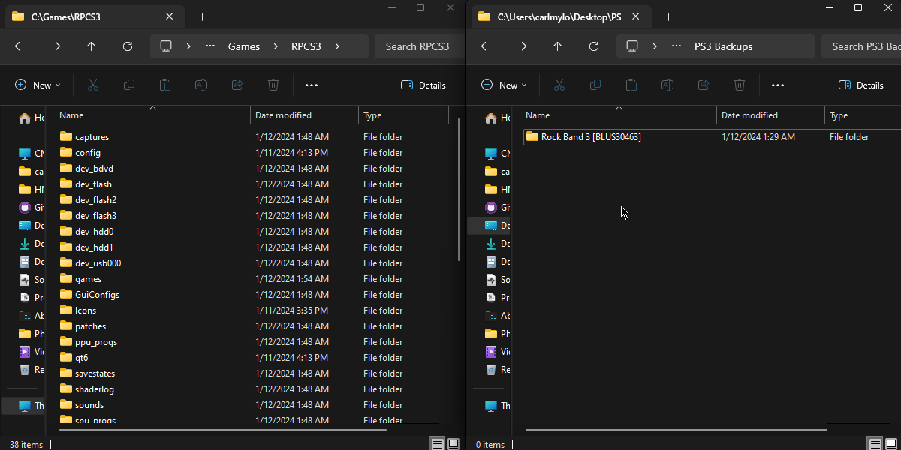

Ahora que Rock Band 3 está en tu biblioteca en RPCS3, necesita ser actualizado. **Necesitas descargar el archivo PKG con la actualización**. La link de abajo va a bajar directamente del servidor de Sony. Es posible que recibas advertencias de seguridad porque el servidor de Sony no utiliza HTTPS.  
[**[¡CLICK AQUÍ PARA DESCARGAR EL PKG DE ACTUALIZACIÓN DE ROCK BAND 3!]**](http://b0.ww.np.dl.playstation.net/tppkg/np/BLUS30463/BLUS30463_T4/e52d21c696ed0fcf/UP8802-BLUS30463_00-ROCKBAND3PATCH05-A0105-V0100-PE.pkg)

El nombre de archivo sera algo así:

Cuando se baje, **arrastra el archivo a RPCS3 y haz click en "Yes" (Si)**, como con el archivo PS3UPDAT.PUP.  
")

 

# Configuración:

*SI HAS CAMBIADO LA CONFIGURACION DE RPCS3, RESTAURA TODO A LO PREDETERMINADO ANTES DE SEGUIR ESTA GUIA.*

 

## Desactivar Actualizaciones:

Dado que las versiones actuales de RPCS3 funcionan peor para Rock Band 3 y otros juegos musicales, **se sugiere quedarse en una versión más un poco vieja y desactivar actualizaciones**.
Para hacer esto, mira la barra de menú de RPCS3, luego **haz clic en Configuration > GUI** (Configuración > GUI).  

**En el menú "Check for updates on startup"** (Buscar actualizaciones en inicio), **cámbialo a "No", luego haz clic en "Apply"** (Aplicar) **y luego en "Save"** (Guardar).  

## Controladores:

**Esta sección es para controladores regulares (guitarras de cinco botones RB/GH, baterías RB/GH).**  
Las guitarras Pro y/o teclados piano se configuran más adelante.

**Haz click con el botón derecho en "Rock Band 3" y selecciona "Create Custom Gamepad Configuration"** (Crear configuración de controladores personalizada)

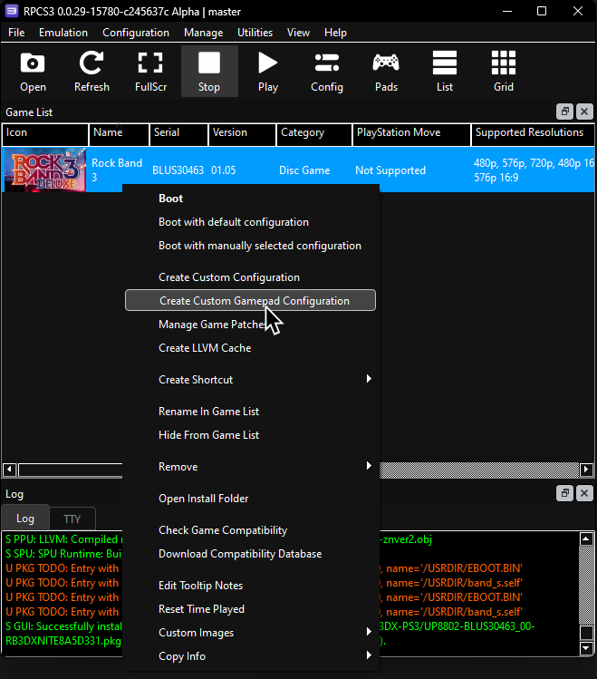

* Si planeas conectar varios instrumentos, _debes configurarlos en diferentes puertos (Port)_.
* Las guitarras y baterías estándar de PS3 _deberían_ funcionar directamente. Si no, sigue las instrucciones de asígnación que se detallan a continuación. 
* Si estás utilizando guitarras de PS3, PS4, o Wii, configura la opción "Handlers" (Manipuladores) en "MMJoystick (Controlador)". 
* Si estás utilizando guitarras de Xbox 360, configura la opción "Handlers" (Manipuladores) en "XInput".
* Si estás utilizando baterías de PS3, PS4, Wii, o Xbox 360, configura la opción "Handlers" (Manipuladores) en "MMJoystick (Controlador)".

Abajo esta una guía de como asígnar los botones en RPCS3.

**Si tu controlador no se detecta, haz click en "Refresh" (Actualizar). Si eso no soluciona el problema, reinicia RPCS3.**

Una vez que hayas terminado de configurar, **recuerda hacer click en "Save" (Guardar).**

  
**Guitarra**:  
**Asegúrate que "Device Class" (Clase de controlador) este en "Guitar".**

**Cambia el menú desplegable junto a él a "Rock Band" si estás usando una guitarra de Rock Band o déjalo en "Guitar Hero" si estás usando una guitarra de Guitar Hero**. 
 
**Algunas guitarras** (especialmente las de Guitar Hero) aveces tienen problemas y **no quieren asígnar botones. Si tratas de asígnar un botón y todo sale con "U+", haz click en "Filter Noise"** en la parte inferior izquierda de la ventana de configuración **y luego intenta asígnar nuevamente**.

| **RPCS3**          | **Guitarras Rock Band** | **Guitarras Guitar Hero** |
|:------------------:|:---------------------:|:-----------------------:|
| Cross (Cruz) |  |  |
| Circle (Circulo) |  |  |
| Square (Cuadro) |  |  |
| Triangle (Triangulo) |  |  |
| L1 |  |  |
| D-Pad: Up (Arriba) |  |  |
| D-Pad: Down (Abajo) |  |  |
| Right Stick:   Left+Right (Izquierda+derecha) |  |  |
| Right Stick:   Up/Down (Arriba/Abajo)   (Para guitarras de PS3/PS4/Wii) |  | |
| L2   (Para guitarras de Xbox 360) |  | |
| R1 |  | No funciona |

**Batería**:

**Asegúrate que "Device Class" (Clase de controlador) este en "Drums" (Batería).**

**Cambia el menú desplegable junto a él a "Rock Band" si estás usando baterías de Rock Band, "Rock Band Pro" si estás utilizando baterías de Rock Band con expansiones Pro, o déjalo en "Guitar Hero" si estás usando baterías de Guitar Hero.**

Si estás utilizando un adaptor de MIDI PRO para 360 con un kit de batería, por favor consulta [**\[el discord de Milohax\]**](https://discord.gg/xrba4CjdNC) para obtener la configuración porque saben mas de esto.

| **RPCS3**    | **Batería Rock Band** | **Batería Rock Band Pro** | **Batería Guitar Hero** |
|:--------:|:---------------:|:-------------------:|:-----------------:|
| Cross (Cruz) |  |  |  |
| Circle (Circulo) |  |  |  |
| Square (Cuadro) |  |  |  |
| Triangle (Triangulo) |  |  | 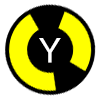 |
| L1 |  |  |  |
| D-Pad |  |  |  |
| R1 |  |  |  |
| R3 |  | Modificador de Címbalos | |
| L3 |  | Modificador de Pads | |

**Vocales**:  
*Para vocales*, puedes *utilizar controladores regulares*. Si estás usando un control de PS4, cambia "Handlers" (Manipuladores) a "DS4". Si estás usando un control de Xbox One, cambia "Handlers" (Manipuladores) a XInput. No es necesario cambiar otra cosa. También puedes usar tu teclado. Usa esta guía como referencia.

| **PlayStation (DS4)** | **Xbox One (XInput)** | **Uso**                         | **Uso Alternativo**        |
|:---------------------:|:---------------------:|:-------------------------------:|:-------------------:|
|  |  | Navegación |
|  |  | Navegación |
|  |  | Seleccionar                          |
|  |  | Atrás                            | Volumen micro 3 (Canción) |
|  |  | Volumen micro 1 (Canción) |
|  |  | Ver Más Información (Biblioteca)        | Volumen micro 2 (Canción) |
|  |  | Opciones                         | Pausa (Canción)        |
|  |  | Filtros (Biblioteca)               | Éxtasís (Canción)    |
| 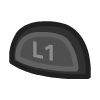 |  | Selección de Parte de Guía (Práctica) |
|  |  | Selección de Parte Vocal (Práctica) |
|  |  | Volumen de Pista Vocal (Canción)       |
|  |  | Corrección de Tono (Canción)         |

  

Abajo esta una guitarra _Höfner de The Beatles: Rock Band para el Wii_ configurada como un ejemplo. Mira como "Handlers" (Manipuladores) está configurado en "MMJoystick (Controlador)" y "Devices" (Controladores) esta en el número de Joystick (Controlador) correcto. Como la guitarra es de Rock Band, "Device Class" (Clase de controlador) en Guitar" y la casílla junto a eso se configura en "Rock Band".

 

## Cuenta De Usuario:
En RPCS3, ve a **Manage > User Accounts** (Administrar > Cuentas de usuario)  
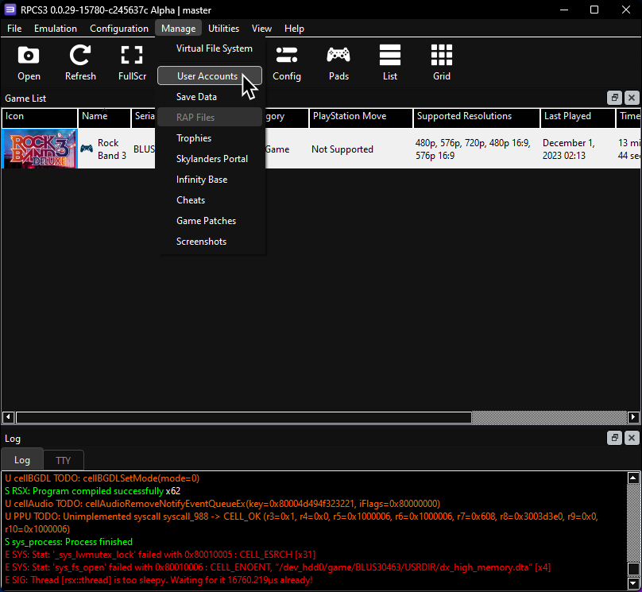

Una vez que estés ahí, dale click en el nombre de usuario predeterminado (00000001 - User) y luego click en **"Rename user"** (Renombrar usuario) y cámbialo al nombre que quieras y luego haz click en "Close" (Cerrar).  

 

## RPCN:
Si no quieres jugar en linea, [[puedes avanzar a la siguiente sección.]](#configuración-rápida)

Ve a **Configuration > RPCN** (Configuración > RPCN)

Haz click en "**Account**":  

Haz click en "**Create Account**" (Cuenta):  

Pon un **Nombre de Usuario (Username)** y **Contraseña (Password)**:    
  
  

Se mostrara una ventana pidiendo un **Email** para así recibir un **codigo de verificación** (verification token):  
  

**Click en "OK"** y ve a la bandeja de entrada de tu Email. Puede que tengas que esperar un par de minutos para que llegue el correo. Si todavia sigues esperando, checa la pestaña de **"Spam"**. El Email se llama **"Your token for RPCN"** (Tu código para RPCN). **Copia los números y letras abajo de "Your token for username [tu usuario] is:"** (Tu codigo para [tu usuario] es):

")

**Pega el token** a RPCS3 Y presiona "OK":  

 

# Configuración Rápida:
Estos archivos son para personas que quieren jugar sin hacer tanta configuración. Como quiera recomiendo que hagas una [[configuración personalizada]](#configuración-personalizada) para ajustar todo a lo mejor que pueda tu computadora.  
**DEBES de tener** [[**Rock Band 3 Deluxe instalado**]](https://github.com/hmxmilohax/rock-band-3-deluxe#-installing-on-rpcs3) no funciona a su máximo potencial.

Para usar estos archivos, **haz click en las configuraciones que deseas descargar y luego extrae los archivos en la carpeta donde esta RPCS3**. Las carpetas se combinaran si hiciste bien.
Los jugadores que deseen utilizar [[micrófonos]](https://github.com/carlmylo/rb3-pc/tree/español-win#audio), [[guitarras Pro con cable, teclados USB/MIDI]](https://github.com/carlmylo/rb3-pc/#io), o [[guitarras PS3 Mustang o teclados RB3 con receptores]](https://github.com/carlmylo/rb3-pc/#wireless-ps3-mustang-pro-guitar-and-ps3-rock-band-3-keyboard-with-receptor) todavía requieren configuración adicional.

* [[Configuración recomendada]](https://github.com/carlmylo/rb3-pc/raw/español-win/config/customconfig/recommended.zip) - Esta configuración es para computadoras que son igual (o mejor) que [los requisitos recomendados](#requisitos).
* [[Configuración mínima]](https://github.com/carlmylo/rb3-pc/raw/español-win/config/customconfig/minimum.zip) - Esta configuración es para computadoras que son igual (o mejor) que [los requisitos mínimos](#requisitos).

Para obtener más información sobre estas configuraciones, [[consulta la pagina de configuraciones rápidas]](https://github.com/carlmylo/rb3-pc/tree/español-win/config/customconfig#about).

 

# Configuración Personalizada:
**Haz click derecho en Rock Band 3** en RPCS3, luego presiona "**Create Custom Configuration**" (Crear configuración personalizada)  
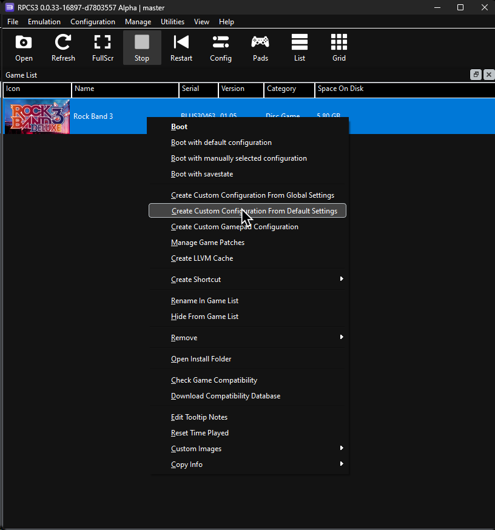

Esto puede parecer abrumador debido a la gran cantidad de opciones, pero he codificado por colores las cosas que requerirán ciertos ajustes. Todo lo que no esté coloreado debe estar en las opciones predeterminadas.

| COLOR | SIGNIFICADO |
|---|---|
|  | *REQUERIDO* |
|  | Para PC's gama baja |
|  | Dependiente de tu PC |
|  | Opcional |

Iremos pestaña por pestaña, así que comencemos con:

 

## CPU

*  **Para PC's Gama Baja** (4 Nucleos/4 Chips de Hilos): 
	* **Cambia el "SPU Block Size"** (Tamaño de bloques del SPU) **a "Mega"** - Para juntar hilos de SPU a ser más pequeños , requiriendo menos núcleos/hilos.
	* **Cambia el "Preferred SPU Threads"** (Hilos preferidos del SPU) **a "1", "2", "3", or "4"** - Puede ayudar a prevenir inestabilidades causadas por sobrecargas de la CPU. Empieza con 4 y bájalo si no mejora.
	* **COMO ULTIMA ALTERNATIVA** **Cambia el "SPU XFloat Accuracy"** (Precisión de Flotante x del SPU) **a "Relaxed"** (Relajada) - Cambiar eso hará que tengas un par de fotogramas pero, **romperá el modo de practica!**

 

## GPU

*  REQUERIDO: 
	* **Activa "Write Color Buffers"** (Ingresar búferes de colores) - Arregla el 99% de los problemas con los personajes teniendo texturas con problemas.
*  Para GPU's gama baja: 
	* Cambia "ZCULL Accuracy (Precisión de ZCull)" a "Relaxed" (Relajada) - Mejora el rendimiento ligeramente pero puede causar anomalías gráficas.
*  Dependiendo de tu GPU: 
	* Cambia "Frame Limit (Limite de fotogramas)" a "Off" para tener fotogramas ilimitadas (puede introducir agitación en el rendimiento del juego), en 60 si quieres fotogramas bloqueadas en 60 FPS (redundante con Vblank de 60 Hz). **Es sugerido utilizar la configuración de tu tarjeta de gráficas para limitar la fotogramas o utilizar un programa como MSI Afterburner.**
	* Ajusta "Shader Quality" (Calidad de Shaders) dependiendo de tu sistema. "Low" (Bajo) y "Medium" (Medio) reducirá la calidad drásticamente, "Auto" usará la configuración sugerida por RPCS3, y "High" (Alto) es la mejor opción. "Ultra" se ve similar a Alta.
	* Ajusta "Resolution Scale" (Nivel de resolución) a tu gusto. Bájalo para obtener mas rendimiento a costa de una drástica pérdida de calidad. Auméntala para obtener gráficos más nítidos.
	* Ajusta el "Resolution Scale Threshold" (Límite de nivel de resolución) dependiendo de la "Resolution Scale" de arriba. Usa el número de porcentaje con el que aumentaste tu resolución (por ejemplo, para 1920x1080, que es un 150%, calcularías cuál es el 150% de 16, lo que sería 24).
*  OPCIONAL: 
	* Activa "VSync (Sincronización vertical)" - Reduce el efecto de rasgado de pantalla y da fotogramas mas estables. Incrementa la latencia ligeramente.

 

## Audio

*  REQUERIDO: 
	* **Activa "Enable Buffering"** (Activar Búfer) - Absolutamente requerido para Rock Band 3. Debería estar activado por defecto, pero si no, actívalo de vuelta.
*  Ajuste dependiendo de tu PC: 
	* Ajusta el "Audio Buffer Duration" (duración de búferes de audio) dependiendo de tu sistema. 
		* **Valores bajos significan menos latencia pero mas CPU** requerido para mantener audio estable.
		* **Valores altos significan mas latencia pero audio mas estable debido a menos forzamiento de la CPU**.
		* Los que juegan vocales son los más afectados por esto porque latencia alta crea un eco. Los jugadores de instrumentos pueden usar la calibración para compensar.
		* Esto se puede cambiar mientras el juego esta abierto pero **requiere recalibración** en los ajustes del sistema de Rock Band 3.
*  Para Vocalistas: 
	* Selecciona tu micrófonos en "Mic1", "Mic2" y "Mic3" para las voces. Si no estas jugando vocales, se usaran para el chat de voz.

 

## I/O
**Esta sección es para teclados USB/MIDI o guitarras Pro con cable.**
* **Si no estás jugando con una guitarra Pro con cable o un teclado USB/MIDI,** [[puedes avanzar a la siguiente sección.]](#network)  
* **Si estás jugando con un Teclado Rock Band 3 para PS3 o una Guitarra Pro Mustang para PS3 inalámbrica,** [[puedes avanzar a la siguiente sección.]](#network)  

**Si tu teclado tiene salida USB**, solo necesitas **conectarlo a tu computadora**.  
  

**Si tu teclado solo tiene una salida MIDI, necesitarás un convertidor de MIDI a USB**.
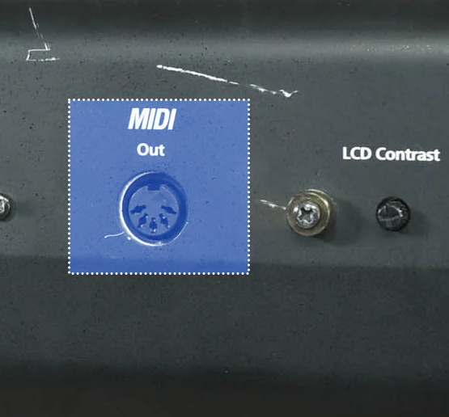  

**Lo mismo se aplica a las guitarras Pro**, porque solo tienen salidas MIDI.
  

Aquí tienes un ejemplo de un convertidor de MIDI a USB. La mayoría vendrán con una luz para mostrar actividad. **Para probar que lo has conectado correctamente, deberías ver que "MIDI In" parpadea cuando presionas una tecla**.  
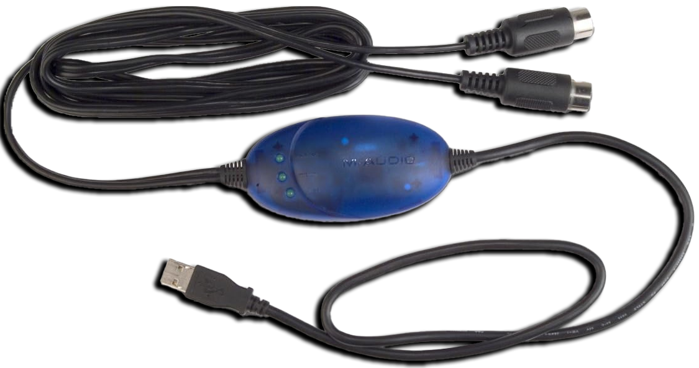  

**Si tienes una interfaz de audio, es posible que ya tengas una forma de conectar MIDI** a tu computadora, ya que algunas interfaces de audio tienen entradas MIDI. Por ejemplo, esta Scarlett tiene conexiones MIDI atrás.  
>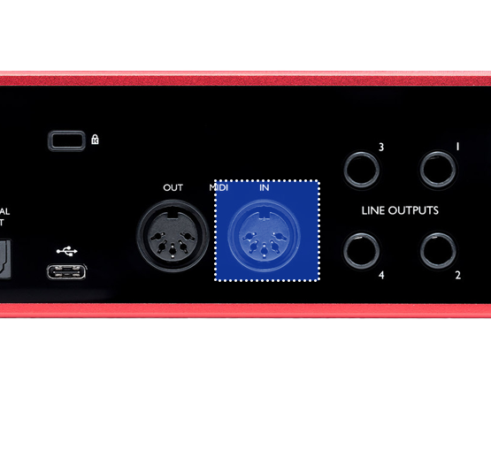  

**Si todo está conectado**, **mira la pestaña I/O de RPCS3**.  

* : 
	* 🎹 **Jugadores de teclado: Deja tu "Emulated MIDI type" (Tipo de MIDI emulado) en "Keyboard" (teclado) y selecciona tu teclado o interfaz MIDI en el menú desplegable junto a él**.
	* 🎸 **Jugadores de Guitarra Pro: Cambia tu "Emulated MIDI type" (Tipo de MIDI emulado) de "Keyboard" (teclado) a "Guitar (17 Frets)"** (guitarra (17 trastes)) **si tienes una guitarra Pro Mustang, o "Guitar (22 Frets)"** (guitarra (22 trastes)) **si tienes una guitarra Pro Squier, luego selecciona tu interfaz MIDI a USB en el menú desplegable junto a él**.
  
 **Si RPCS3 no detecta tu instrumento, haz click en "Save custom configuration"** (Grabar configuración personalizada), **cierra la ventana de "Create Custom Configuration"** (Crear configuración personalizada) **y luego haz click con el botón derecho en Rock Band 3 para volver a abrirla. Si eso no funciona, reinicia RPCS3.**  
  
**Teclados no tienen botones de PS3, así que el primer octavo esta emulando botones de PS3**. Utiliza la siguiente imagen como referencia. **Te recomiendo poner etiquetas o algo así en tu teclado para recordarte qué hace cada tecla junto con rangos de colores**.
  

 

## Network

*  REQUERIDO: 
	* **Cambia Network Status** (estado de red) **a "Connected"** (conectado) **como se remarca en la imagen. Si la dejas en "Disconnected" (desconectado), el juego se congelara mientras navegas por la biblioteca de canciones.**
*  Para el Multijugador: 
	* Activa **"Enable UPNP"** (activar UPnP) o **reenvía el puerto 9103 (UDP) en tu cortafuegos. No actives UPNP mientras reenvías el puerto** ya que esto puede causar crasheos.
	* **Unete al \[[Servidor de RBEnhanced](https://discord.gg/6rRUWXPYwb)\] y ve al canal [\[#gocentral-connecting\]](https://discord.com/channels/953085263008129064/1076031372185042984)**. **Sigue las Instrucciones para RPCS3**. Aunque la imagen de arriba incluye detalles, esto puede cambiar a cualquier minuto. Siempre **referirte al \[[Servidor de Discord de RBEnhanced](https://discord.gg/6rRUWXPYwb)\] para** esta **información**. Mientras estas ahí puedes organizar sesiones con otros jugadores.

 

## Advanced

* : 
	* **Cambia el "Exclusive Fullscreen Mode"** (Modo de exclusividad de pantalla llena) **a "Prefer borderless fullscreen"** (preferir pantalla llena sin bordos) para prevenir posibles crasheos o desincronización al cambiar la prioridad del programa.
	* **Cambia el "Driver Wake-up Delay"** (Retraso de activacion de controlador) **a "20µ" si experimentas algunos congelamientos luego de algunas canciones. Incrementalo a "40µ" si sigue pasando.** 
* : 
	* **Ajusta el "VBlank Frequency"** (intervalo vertical) **si quieres unos fotogramas internos altos. Esto puede hacer que atinar las notas sea mas facil, pero puede causar inestabilidad gráfica o problemas de conexión en linea. Es mejor dejarlo tal como esta.**
*  Ajuste dependiendo de tu PC: 
	* **Activa "Debug Console Mode"** (Modo de consola de depuración) **con Rock Band 3 Deluxe instalado, para aumentar acceso a mas memoria. Esto ayudar a tener sesiones mas largas y mejor estabilidad.**

 

## Emulator

Puedes dejar esto como quieras, pero yo consideraria cambiar las siguientes opciones:
*  Cambios Opcionales: 
	* **"Show trophy popups"** - Simula la notificacion de trofeos de la PS3. Personamente desactivo esto ya que el juego tiene sus propias notificaciones.
	* **"Show PPU compilation hint"** - Esto crea una notificacion cuando RPCS3 esta compilando unidades del PPU. Esto solo sale si tienes la opción "Recompiler (LLVM)" activada en la pestaña de CPU.
	* "Show shader compilation hint" - Esto crea una notificación cuando RPCS3 esta compilando shaders. Ya sea si lo dejas activado o no ya es cosa tuya, pero debo decirte que esto es importante. Cuando ejecutas juegos de PS3, tiene que compilar shaders para "trasladar" los gráficos de una PS3 a un formato que tu PC pueda usar. **El juego seguirá trabándose mientras esto pase** . **Esto Pasa en TODOS los PC's.** Cuando termine de compilar un efecto, **esto usualmente ya no vuelve a pasar otra vez**. **La mejor forma de lidiar con esto es** simplemente **jugar al juego normalmente** y luego se ira rápidamente. Tambien puedes activar el modo de "Autoplay" y dejar que el juego toque unas canciones hasta que pare de trabarse tanto.
	* "Start games in Fullscreen mode" - Obviamente solo cambia el modo de pantalla completa cuando inicias Rock Band 3. Personalmente yo activo esto.
	* "Use Native Interface" - Desactivar esto hara que se remuevan todas las notificaciones de RPCS3 mientras estás  jugando, incluyendo el teclado. En su lugar, verás una interfaz más antigua.

Y con eso termina la parte difícil.

 

# Guitarras Mustang PRO y Teclados inalámbricos de PS3 con Receptores

Si no estás utilizando una Guitarra Mustang Pro de PS3 y un Teclado Rock Band 3 de PS3 con sus receptores respectivos, [[puedes avanzar a la siguiente sección.]](#guitarras-mustang-pro-y-teclados-inalámbricos-de-ps3-con-receptores)

Para comenzar, **cierra RPCS3** y conecta el receptor del instrumento a tu computadora.

Ahora, [**\[ve al sitio de Zadig\]**](https://zadig.akeo.ie/) y **descárgalo**. Cuando termine de bajar, **ábrelo**.

Haz click en **Options** (Opciones) y luego en **List All Devices** (Listar dispositivos).  
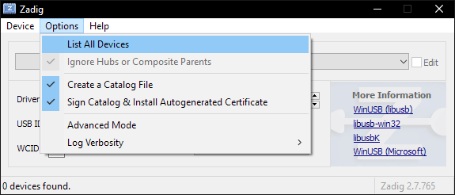

Deberías ver una lista de dispositivos ahora. **Selecciona tu Instrumento Pro de Rock Band 3**. En este ejemplo, estamos utilizando la Guitarra Mustang Pro, que aparece como "Harmonix RB3 Mustang Guitar for PlayStation® 3".  
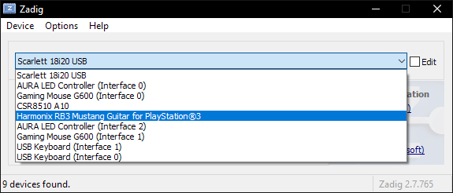

Después de seleccionar el dispositivo correcto, deberías ver la opción para reemplazar el controlador. **ASEGÚRATE DE QUE SOLO ESTÁS REEMPLAZANDO EL CONTROLADOR DEL INSTRUMENTO PRO DE ROCK BAND 3**. **Haz click en "Replace Driver" (Reemplazar controlador)**.  

Aparecerá una advertencia. **Nuevamente, asegúrate de haber seleccionado tu Guitarra Mustang Pro o teclado de Rock Band 3.** Después de haberlo verificado, haz click en "**Yes**" (Sí).  

Luego, se instalará el controlador. Como dice el programa, esto puede llevar algunos minutos.  

Si todo sale bien, verás este mensaje:  
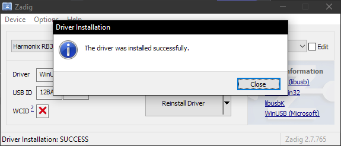

**Cierra Zadig** y, con el receptor todavía conectado, **abre RPCS3** y **abre Rock Band 3**.

Enciende tu controlador y deberías ver que automáticamente se le asigna un número de jugador.
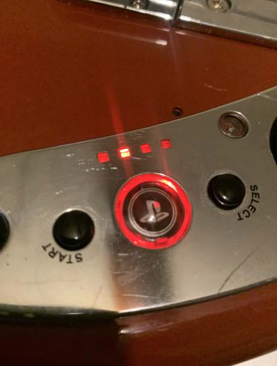

Del mismo modo, en Rock Band 3, verás el instrumento listo para unirse.  

 

## Soluciones De Problemas

*   **_Audio Entrecortado_**

	* 
	* Aumenta el "Audio Buffer Duration" como se menciona en [[la pestaña de Audio de la configuración personalizada]](#Audio) hasta que el Audio Entrecortado se detenga. 100 ms es un buen comienzo para computadoras de baja gama.

*   **_Problemas Generales de Rendimiento_**
	* Cambia el plan de energía de tu computadora a "Máximo rendimiento"
	*   Regresa y Lee las sugerencias para PCs de gama baja en la [[sección de configuración personalizada]](#cpu).
	*   Instala [[Rock Band 3 Deluxe](https://github.com/hmxmilohax/rock-band-3-deluxe/tree/main#playstation-3) y deshabilita efectos adicionales en el apartado "Deluxe Settings"

*   **_El juego no se llena en toda la pantalla_**
	*   Activa la opción "Tamaño" en las opciones de RB3.

*   **_El juego tiene retraso de Audio o Notas_**
	*   Entra a calibración en el menú de opciones de RB3 si no lo has hecho. Deshabilita la opción "Dolby Digital" en el mismo menú.

*   **_El juego crashea cuando practico en guitarra/bajo regular_**
	*   Este es un error conocido que todavía no tiene solución.
	
*   **_No puedo usar la Calibración Automática_**
	*   La calibración automática solo funciona con las guitarras de PS3 en directo.

*   **_El juego se traba al ponerle nombre a un personaje_**
	*   Esto es un problema conocido de RPCS3. Puedes solucionarlo cambiando moviendo el switch de efectos en una Guitarra de RB. Es sugerido usar un control regular para crear personajes y nombrar cosas. De lo contrario, cambiando tu controlador de entrada en "[[crear configuración de controladores personalizada]](#controladores)" a "Keyboard" (teclado) y luego regresarlo a donde lo tenias originalmente lo arregla. Esto se puede hacer mientras el juego se esta ejecutando.

*   **_Los instrumentos o accesorios de los personajes flotan o los traspasan_**
	*   Actualmente no hay ninguna solución para esto. Si te pasa esto esto, [[por favor reporta tus descubrimientos en el GitHub de RPCS3.]](https://github.com/RPCS3/rpcs3/issues/8408)

*   **_Al navegar por la biblioteca hay pausas largas_**
	*   En ese caso, olvidaste poner el "Network Status" a "Connected" en la [[pestaña "Network" al hacer la configuración personalizada]](#network) para Rock Band 3.

*   **_Instrumentos de PS3 se detectan como dos_**
	*   Creaste una [[configuración de controladores personalizada]](#controladores) para un control de PS3, que usualmente no se necesita. Desborra la configuración del controlado y todo debe de estar bien.

- **_[Rock Band 3 Deluxe] Crasheo en el video de introducción_**
  * Tienes archivos de una version vieja. Ve a la carpeta del juego en `dev_hdd0\game\BLUS30463\USRDIR` y desborra todos los archivos con extensión `.dta`, excepto a `dx_high_memory.dta`.

	
*   **_[Bateria Pro] Golpear dos platillos se registra como un tambor_**
	*   Este es un problema conocido de Rock Band 3. Lastimosamente no se la solución ya que no juego la batería. Por favor siéntete pregunta en el servidor de Discord de MiloHax.

*   **_\[ONLINE\] No puedo encontrar al tercer o cuarto jugador_**
	*   En la Configuracion Personalizada de Rock Band 3, [[ve a la pestaña de "Network" de de configuración personalizada]](#network) y asegurate de tener activado la opción "Enable UPNP". Si por alguna razón no puedes activar el UPNP, tendrás que redireccionar el puerto 9103 (UDP) en tu cortafuegos . **No actives el UPNP mientras estas redireccionando el puerto** ya que esto puede causar crasheos.

*   **_\[ONLINE\] Crasheo cuando busco jugadores**
  - Si tienes UPNP prendido en la Configuración Personalizada de Rock Band 3 [[sección de Network]](#network), deberás desactivarlo y [[buscar cómo configurar el reenvío de puertos en tu enrutador]]([https://www.noip.com/support/knowledgebase/general-port-forwarding-guide](https://es.wikihow.com/configurar-el-reenv%C3%ADo-de-puertos-en-un-router)).
	
*   **_\[ONLINE\] Al tratar de conectar a GoCentral el juego se queda en "Registering Account_**
	*   Puede que hayas perdido la conexión a RPCN o GoCentral y tendrás que reiniciar el Juego. Si continuas teniendo esto luego de haber reiniciado, ve al menú de arriba en RPCS3 a, "Configuration" > "RPCN" > "Account" > "Test Account" luego reinicia el juego para forzar una reconexión.

*   **_\[ONLINE\] Me sigo descontando mientras juego en linea_**
	*   Chequea que no estés bajando algo y que tu conexión al internet no este sobrecargada. Si cambiaste tu VBlank a mas de 60 Hz, bájalo de vuelta a 60 Hz. Además, necesitas tener una conexión estable tanto con RPCN y los servidores de GoCentral.

*   **_"Seguí todos los pasos y todavía tengo crasheos/mal rendimiento"_**
	*   Revisa nuevamente para asegurarte de que has seguido cada paso correctamente. Esta guía ha sido probada y ha demostrado funcionar para muchas personas con diferentes tipos de hardware. Si estás absolutamente seguro de haber seguido cada paso correctamente, es muy probable que el archivo del juego que tienes esté dañado en un 90%, que haya un 9% de posibilidades de que tu computadora se haya quedado sin espacio en disco, y un 1% que la chingaste.

 

## Conclusión

Eso es todo! Ahora (Con un poco de suerte) tienes un manera funcional para jugar Rock Band 3 en Tu computadora. Mientras estas acá, porque no te unes a algunas comunidades que están ayudando a mantener viva la Comunidad de Rock Band?

**Rock Band 3 Deluxe/Milohax:** 

Desarroladores del imprescindible Mod Rock Band 3 Deluxe que no puedo recomendar lo suficiente. [\[Descarga Aqui.\]](https://github.com/hmxmilohax/rock-band-3-deluxe#readme) Además de agregar muchas características de calidad de vida como arranques más rápidos, escenarios a 60 fps y carga automática de contenido descargable, **también incluye RB3_Plus, que agrega Pro Keys adicionales y Pro Guitar/Bass a canciones que no las tenían.** **¡Si tienes un instrumento Pro, esto es imprescindible!** Además de esto, hay varias opciones de personalización visual, como el uso de Apariencias de Rock Bands más antiguos (y más nuevos) e incluso de Guitar Hero. [Puedes \[Unirte al servidor de MiloHax\]](https://discord.gg/xrba4CjdNC).

**RBEnhanced:**

[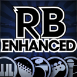](https://rb3e.rbenhanced.rocks/ "RBEnhanced")

Desarrolladores del Increible mod RBEnhanced el cual solamente existe para Xbox 360 y Wii. Los mismos desarrolladores también ayudan y mantienen el servidor de GoCentral el cual es la única manera de jugar Rock Band 3 en linea en Xbox,PS3 y Wii por el Momento. Puedes [**\[unirte al servidor de RBEnhanced Aqui\]**](https://discord.gg/6rRUWXPYwb).

Agradecimientos especiales a:

*	[SlothDemon](https://www.youtube.com/@SlothDemon1991) por ayudar a traducir esta guía y ayudarme a recordar como escribir Español.
*   [DarkRTA](https://www.youtube.com/@darkrta), [Linos](https://www.youtube.com/@LinosMelendi), [Jnack](https://www.youtube.com/@jnackmclain), [Hughtobasíc](https://www.youtube.com/@thisisRK), [ihatecompvir](https://www.youtube.com/@ihatecompvir1591), and [LysiX](https://www.youtube.com/@LysiX) por informacion tecnica sobre RPCS3 y Rock Band 3.
*   qfoxb, [SlothDemon](https://www.youtube.com/@SlothDemon1991), [Jnack](https://www.youtube.com/@jnackmclain) (el cual hizo pruebas por 40 horas xd), knvtva, y 1osks por reportar resultados.
*   RPCS3 Wiki por tener una cantidad decente de información sobre los Controladores y los Traspasos Via USB.
*   [TheNathannator](https://github.com/TheNathannator) por su [GitHub de PlasticBand](https://github.com/TheNathannator/PlasticBand) por mejor documentación de controladores.

  
This work is licensed under a [Creative Commons Attribution-ShareAlike 4.0 International License](http://creativecommons.org/licenses/by-sa/4.0/).

